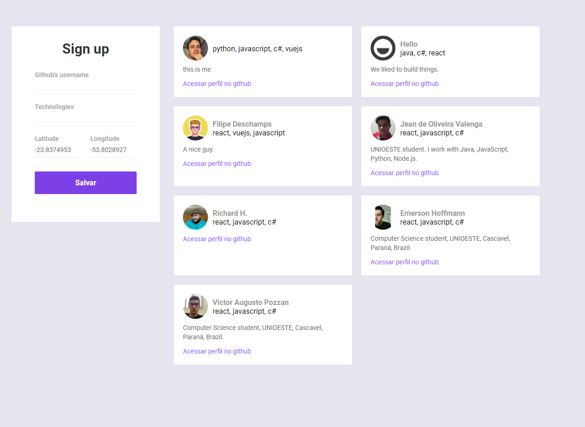
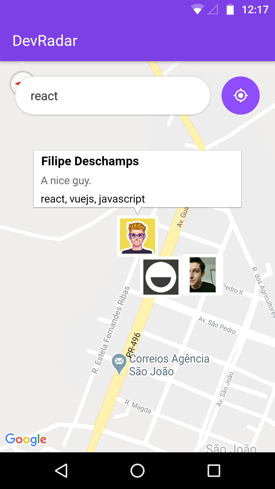

<h1 align="center">
  DevFinder
</h1>

<h1 align="center">
  

    
    
  

    
</h1>

### 📜 Sobre
Este projeto tem como idéia encontrar devs próximos utilizando geolocalização e filtrar por tecnologias, ele é composto por uma aplicação web em ReactJS, mobile em ReactNative e uma API REST (Node.js) como backend. 

A aplicação em **Node.js** (backend) é uma **API REST** escrita em **Node.JS** que serve dados tanto ao frontend quanto ao mobile. 

A aplicação em **ReactJS** (frontend) é para o administrador **cadastrar usuários através de seus respectivos nomes de usuário no github, tecnologias e localização atual**.

A aplicação em **React Native** é para o usuário encontrar os devs que esteja entro do raio da aplicação e por suas tecnologias cadastradas.

### 🔽 Requisitos
1. Ter o **NodeJs** e o **Yarn** instalado
2. Um dispositivo ou emulador **Android** conectado ao computador

### :rocket: Começando
1. ``git clone https://github.com/Negreyscow/DevFinder``
2. ``cd DevFinder``

### :rocket: Iniciando com o backend
1. ``cd backend``
2. ``yarn dev``

### 💻 Iniciando com o Front-end 
1. ``cd frontend``
2. ``yarn``
3. ``yarn start`

### 📱Iniciando com o Mobile (Apenas Android)
1. ``cd mobile``
2. ``react-native start``
3. ``react-native run-android``

### 🧰  Ferramentas utilizadas
- ⚛️ **ReactJs** - Biblioteca Javascript para criar interfaces de usuário.
- ⚛️ **React Native** - Framework para criar apps nativos usando React.
- ⚙️ **MongoDB** - Banco de dados.

 por Leonardo Caracho 

